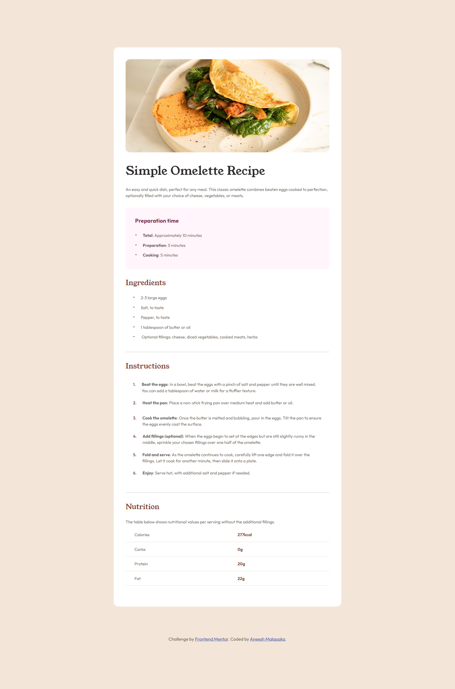
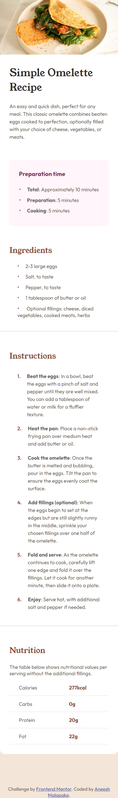

# Frontend Mentor - Recipe page solution

This is a solution to the [Recipe page challenge on Frontend Mentor](https://www.frontendmentor.io/challenges/recipe-page-KiTsR8QQKm). Frontend Mentor challenges help you improve your coding skills by building realistic projects.

## Table of contents

- [Overview](#overview)
  - [The challenge](#the-challenge)
  - [Screenshot](#screenshot)
  - [Links](#links)
- [My process](#my-process)
  - [Built with](#built-with)
  - [What I learned](#what-i-learned)
- [Author](#author)

**Note: Delete this note and update the table of contents based on what sections you keep.**

## Overview

### The Challenge

The challenge is to build out this recipe page and get it looking as close to the design as possible.

We can use any tools you like to help us complete the challenge. So if you've got something you'd like to practice, feel free to give it a go.

### Screenshot




### Links

- Solution URL: [Add solution URL here](https://github.com/Aneesh-Malapaka/frontend-mentor-newbie-challenges/tree/main/recipe-page-main)
- Live Site URL: [Add live site URL here](https://your-live-site-url.com)

## My process

### Built with

- Semantic HTML5 markup
- CSS custom properties
- Flexbox

### What I learned

In this particular challenge, attention to detail mattered the most, while I believe I might have missed the exact replication (based on image rather than figma design _cons of free subscription_) What I liked the most is the colored indices for the list items.

- Although for unordered lists its just using the pesudo-class ::before and modifying the index, for ordered lists, the numbers needed color and the easiest way I found online is to use the following:

```css
ol {
  counter-reset: item;
}
ol li:before {
  content: counter(item) ". ";
  counter-increment: item;
  color: var(--nutmeg);
  padding-right: 20px;
  margin: 10px 0;
  font-weight: 600;
}
```

## Author

- Website - [Aneesh Malapaka](https://aneesh-malapaka-portfolio.netlify.app/)
- Frontend Mentor - [@Aneesh-Malapaka](https://www.frontendmentor.io/profile/Aneesh-Malapaka)
