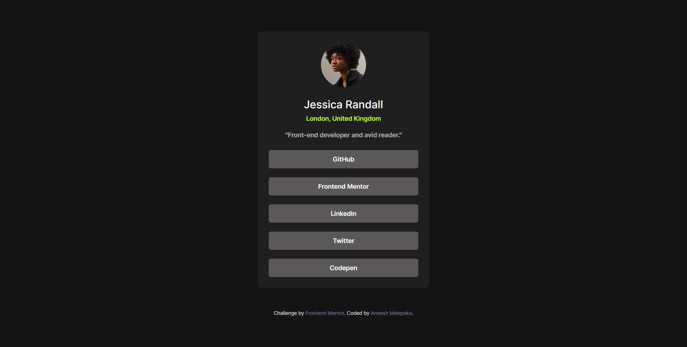
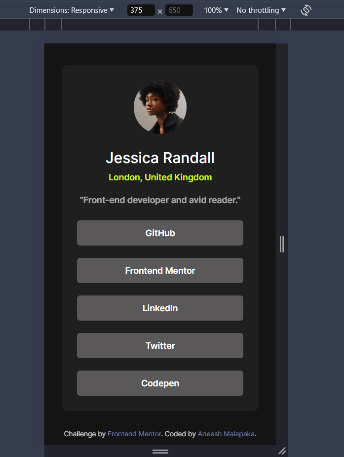

# Frontend Mentor - Social links profile solution

This is a solution to the [Social links profile challenge on Frontend Mentor](https://www.frontendmentor.io/challenges/social-links-profile-UG32l9m6dQ). Frontend Mentor challenges help you improve your coding skills by building realistic projects.

## Table of contents

- [Overview](#overview)
  - [The challenge](#the-challenge)
  - [Screenshots](#screenshot)
  - [Links](#links)
- [My process](#my-process)
  - [Built with](#built-with)
  - [Useful resources](#useful-resources)
- [Author](#author)

## Overview

### The challenge

Users should be able to:

- See hover and focus states for all interactive elements on the page

### Screenshot

### Links

- Solution URL: [Github Repo](https://github.com/Aneesh-Malapaka/frontend-mentor-newbie-challenges/tree/main/social-links-profile-main)
- Live Site URL: [Social Links Live Site](https://social-links-fm-challenge.netlify.app/)

## My process

### Built with

- Semantic HTML5 markup
- CSS custom properties
- Flexbox
- Mobile-first workflow

### Useful resources

- [Media Queries General Breakpoints](https://www.w3schools.com/css/tryit.asp?filename=tryresponsive_mediaquery_breakpoints) - This link redirects to an example with the typical breakpoints used in web design. (By W3Schools)

## Author

- Website - [Aneesh Malapaka](https://aneesh-malapaka-portfolio.netlify.app/)
- Frontend Mentor - [@Aneesh-Malapaka](https://www.frontendmentor.io/profile/Aneesh-Malapaka)
